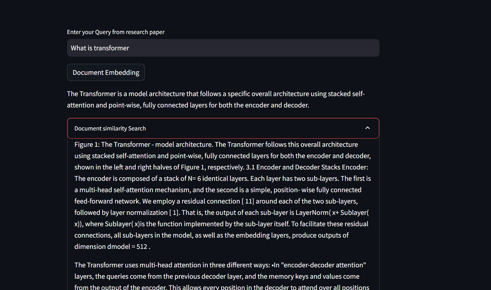

# RAG-QA-Chatbot
📄 RAG Chatbot using Groq + LangChain + Streamlit

An end-to-end Retrieval-Augmented Generation (RAG) chatbot that allows users to query research papers using natural language. The app processes PDFs, creates embeddings, stores them in a vector database, and retrieves relevant context to generate accurate answers using Groq LLM.

🚀 Live Demo

🔗 Deployed App:
https://rag-app-chatbot-groq.streamlit.app/

🧠 Features
📚 Upload and process research papers (PDFs)
🔍 Semantic search using vector embeddings
⚡ Fast responses using Groq LLM (LLaMA 3.1)
🧩 Context-aware answers using RAG pipeline
📊 View retrieved document chunks for transparency
⏱️ Response time tracking
🛠️ Tech Stack
Frontend: Streamlit
LLM: Groq (llama-3.1-8b-instant)
Embeddings: HuggingFace (all-MiniLM-L6-v2)
Vector Store: FAISS
Framework: LangChain
Document Loader: PyPDFDirectoryLoader

   
  <b>RAG Chatbot Output</b>

